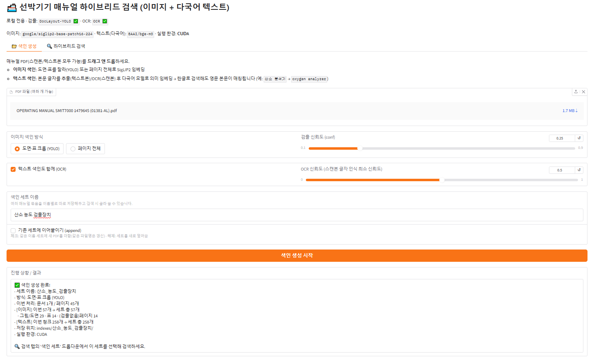
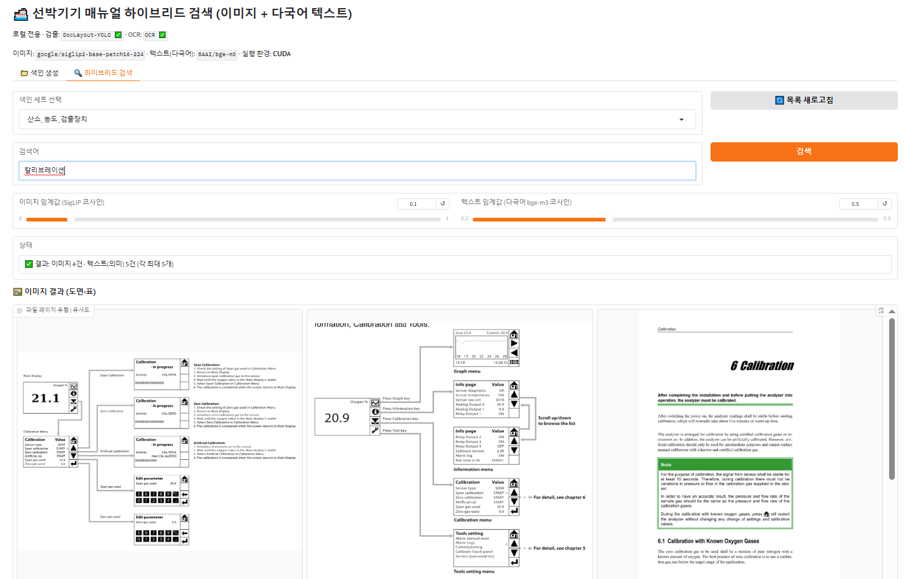
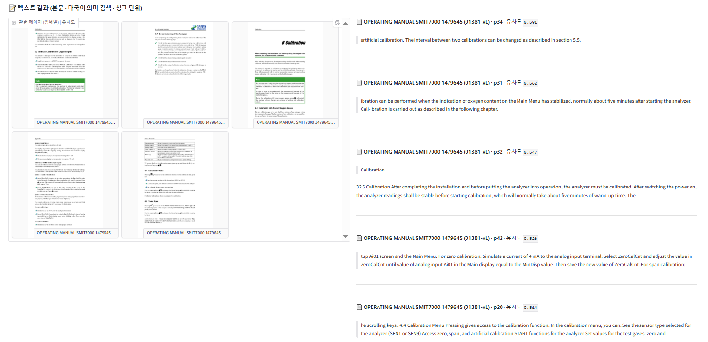
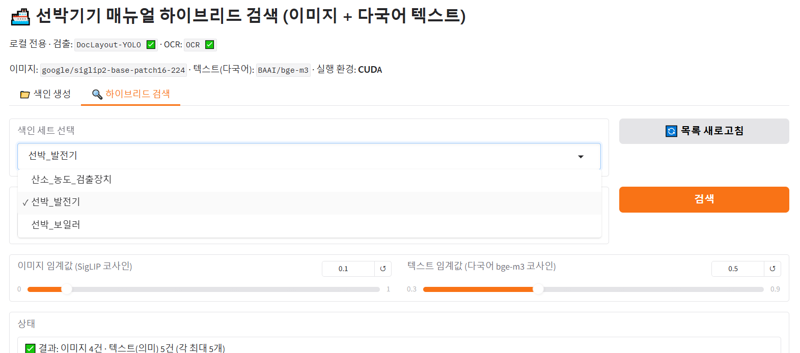

# 🚢 선박기기 매뉴얼 하이브리드 검색 (marine-manual-search)

선박기기 매뉴얼 PDF에서 **도면·표(이미지)** 와 **본문(텍스트)** 를 함께 찾아주는 **완전 로컬** 검색 도구입니다.
스캔본·텍스트본이 섞여 있어도 동작하며, **한글로 검색해도 영문 매뉴얼**이 매칭됩니다. (예: `산소 분석기` → `oxygen analyzer`)

> 외부 API·인터넷 통신 없이 로컬에서만 동작합니다. AI 모델 가중치는 최초 1회만 내려받고 이후 오프라인으로 동작합니다.

📚 **문서**: [문제 정의서](PROBLEM_STATEMENT.md) · [모델 선정 근거](MODEL_SELECTION.ipynb) · [개선 효과 검증](EVALUATION.ipynb)

---

## ✨ 주요 기능

- **멀티모달 검색** — 텍스트 질의로 도면·표 **이미지**를 검색 (그래프·배관도·분해도 등)
- **다국어 의미 검색** — 한글 질의 ↔ 영문 본문 교차언어 매칭 (키워드 일치가 아닌 의미 기반)
- **스캔본 지원** — 텍스트 레이어가 없으면 자동 OCR
- **레이아웃 검출** — DocLayout-YOLO로 페이지에서 도면·표 영역만 잘라 정밀 색인
- **청크 단위 색인** — 긴 페이지도 문단 단위로 나눠 정확도 향상 (RAG 확장에 그대로 활용 가능)
- **매뉴얼 세트 관리** — 장비/호선별로 색인을 이름 붙여 저장하고 검색 시 선택, 이어붙이기(append)·덮어쓰기 지원

---

## 🖼️ 동작 결과 (스크린샷)

> `screenshots/` 폴더에 아래 파일명으로 이미지를 넣으면 자동으로 표시됩니다.

| 화면 | 스크린샷 |
|---|---|
| 색인 생성 탭 |  |
| 이미지 검색 결과 (도면·표) |  |
| 텍스트 검색 결과 (다국어 의미) |  |
| 매뉴얼 세트 선택 |  |

---

> 📓 **모델을 왜 이렇게 골랐는지**(대안 비교·실측 수치)는 [`MODEL_SELECTION.ipynb`](MODEL_SELECTION.ipynb) 참고.

## 🧠 적용 기술 · 모델

| 구분 | 이름 | 역할 |
|---|---|---|
| 이미지 임베딩 | `google/siglip2-base-patch16-224` | 도면·표 이미지를 벡터로 변환, 텍스트 질의와 매칭 |
| 텍스트 임베딩 | `BAAI/bge-m3` | 본문 청크를 벡터로 변환, 다국어(한↔영) 의미 검색 |
| 레이아웃 검출 | `DocLayout-YOLO` (DocStructBench) | 페이지에서 그림/표 영역 검출·크롭 |
| OCR | `rapidocr-onnxruntime` | 스캔본 PDF의 글자 인식 (한글+영어) |
| PDF 처리 | `PyMuPDF (fitz)` | 페이지 렌더링·텍스트 추출 |
| GUI | `Gradio` | 웹 기반 색인·검색 인터페이스 |
| 딥러닝 런타임 | `PyTorch` | CUDA / Apple MPS / CPU 자동 감지 |

---

## ⚙️ 요구 사항

- Python 3.10+ (개발·검증 환경: Windows 10 · Python 3.14)
- 최초 실행 시 모델 다운로드용 인터넷 (이후 오프라인)
- (선택) NVIDIA GPU — 색인·검색 가속

## 📦 설치

```bash
pip install -r requirements.txt
```

### (선택) GPU 가속 — NVIDIA CUDA

기본 `torch`는 CPU 빌드입니다. NVIDIA GPU가 있으면 CUDA 빌드로 교체하세요:

```bash
pip uninstall -y torch
pip install torch --index-url https://download.pytorch.org/whl/cu130
```

> Apple 실리콘(Mac)은 기본 `torch`가 MPS를 자동 지원합니다. CUDA 단계는 건너뛰세요.

## ▶️ 실행

```bash
python app.py
```

- Windows에서는 `run.bat` 더블클릭으로도 실행됩니다. (경로가 다르면 `run.bat` 안의 파이썬 경로를 수정)
- 실행 후 브라우저가 자동으로 열립니다 (`http://127.0.0.1:7860`).

---

## 📖 사용법

### 1) 📁 색인 생성 탭
1. 매뉴얼 PDF를 드래그 앤 드롭 (여러 개 가능)
2. **이미지 색인 방식** 선택
   - `도면·표 크롭 (YOLO)` : 그림·표 영역만 잘라 색인 (정밀)
   - `페이지 전체` : 페이지 통째로 색인 (비교용 baseline)
3. **텍스트 색인도 함께 (OCR)** 체크 — 본문 글자 검색 활성화
4. **색인 세트 이름** 입력 (예: `엔진_매뉴얼`) — `이어붙이기(append)`로 기존 세트에 추가 가능
5. `색인 생성 시작`

### 2) 🔍 하이브리드 검색 탭
1. **색인 세트** 드롭다운에서 검색할 묶음 선택
2. 검색어 입력 (한글/영어) → `검색`
3. 결과
   - 🖼️ **이미지 결과** : 관련 도면·표 크롭
   - 📝 **텍스트 결과** : 관련 페이지 썸네일 + 매칭 본문 청크 전문
4. 임계값 슬라이더로 결과 개수 조절 (이미지·텍스트 각각)

---

## 🗂️ 프로젝트 구조

```
marine-manual-search/
├─ app.py                  # 전체 앱 (색인·검색·GUI)
├─ PROBLEM_STATEMENT.md    # 문제 정의서 (도메인·문제·가설·사용자·성공기준)
├─ MODEL_SELECTION.ipynb   # 모델 선정 근거 (대안 비교·실측 수치)
├─ EVALUATION.ipynb        # 개선 효과 검증 (키워드 vs 의미검색 hit@5·속도)
├─ requirements.txt        # 의존성
├─ run.bat                 # Windows 실행 스크립트
├─ screenshots/            # README용 스크린샷
└─ indexes/                # (git 제외) 세트별 색인 데이터 — indexes/<세트>/{index.npz, crops/, pages/}
```

## 🔬 동작 원리 (파이프라인)

```
[색인] PDF → 페이지 렌더(PyMuPDF)
           → 도면·표 검출·크롭(DocLayout-YOLO) → 이미지 임베딩(SigLIP2)
           → 본문 추출(get_text/OCR) → 청크 분할 → 텍스트 임베딩(bge-m3)
           → indexes/<세트>/index.npz 저장

[검색] 질의어 → 이미지: SigLIP2 텍스트 임베딩 → 코사인 유사도
              → 텍스트: bge-m3 임베딩 → 코사인 유사도 (다국어)
              → 임계값 이상 상위 결과 표시
```

## 🚀 로드맵

- [ ] 로컬 LLM 연결 → **RAG** (근거 기반 답변 + 출처 페이지 표시)
- [ ] 레이아웃 기반 청킹 (다단·스캔본 정밀도 향상)
- [ ] 검색 결과 리랭킹

---

## 📄 라이선스 / 참고

- 개인/연구용 PoC. 사용된 모델의 라이선스는 각 HuggingFace 페이지를 따릅니다.
- 매뉴얼 PDF·색인 데이터는 저장소에 포함되지 않습니다(`.gitignore`).

> AIFFEL 과제 PoC — "내 도메인에 AI를 적용해 실제 개선을 증명하기".
